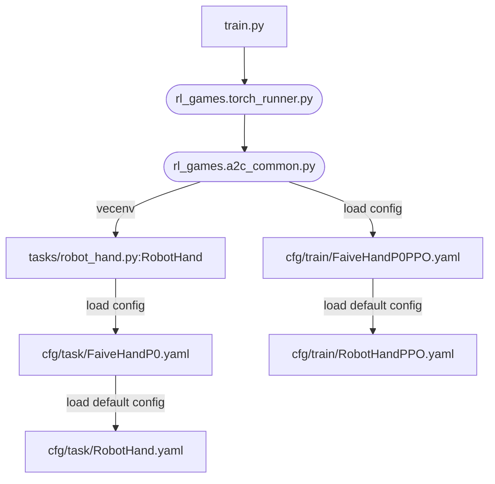

# faive_gym
IsaacGym environments for the Faive Hand, intended to be used together with IsaacGymEnvs


1. Install Isaac Gym
    1. Download Isaac Gym Preview 4 from the [website](https://developer.nvidia.com/isaac-gym)
	1. Check isaacgym/docs/index.html for install instructions, but this README also documents a fast way to set it up
    1. Recommended: create a conda or venv (virtual environment) Python 3.8 environment for installation. To create and activate a Python 3.8 venv,
	    1. `python3.8 -m venv ~/rlgpu` to create a new venv called "rlgpu" in the home directory. You might have to first run `sudo apt install python3.8-venv` to install the virtual environment package.
		1. `source ~/rlgpu/bin/activate` to activate the venv. You must run this to enter the venv every time a new terminal is opened.
    1. Install isaacgym with pip
	    ```bash
	    cd /path/to/isaacgym/python
	    pip install -e .
	    ```
		You might have to first run `sudo apt install python3.8-dev`.
	1. test installation
	    ```bash
		cd examples
		python joint_monkey.py
		# if you are connecting to a remote instance from Windows, GUI is not available so this command will fail- in which case you could run a non-GUI example program, e.g.
		python asset_info.py
		```
1. Install IsaacGymEnvs
    1. Clone the repository
		```bash
		git clone https://github.com/NVIDIA-Omniverse/IsaacGymEnvs
		```
		You might have to first run `sudo apt install git`.
	1. Install with pip
		```bash
		cd /path/to/IsaacGymEnvs
		pip install -e .
		```
	1. Test installation
		```bash
		cd isaacgymenvs
		python train.py
		```
	1. [optional] If an error about protobuf version appears, you may have to specify the version of protobuf, with
		```bash
		pip install --upgrade protobuf==3.20.0
		```
	1. [optional] if the error `ModuleNotFoundError: No module named 'tkinter'` appears, you must install it with
		```bash
		sudo apt install python3-tk
		```
1. Install this repository (faive_gym)
	1. If you haven't already, [add the SSH public key to your GitHub account](https://docs.github.com/en/authentication/connecting-to-github-with-ssh/adding-a-new-ssh-key-to-your-github-account)
    1. Clone this repository
		```bash
		git clone git@github.com:srl-ethz/faive_gym.git
		```
	1. Install with pip
		```bash
		cd /path/to/faive_gym
		pip install -e .
		```

The default Faive Hand training environment can be run with
```bash
cd /path/to/faive_gym/faive_gym
python train.py task=FaiveHandP0
```
## Additional Arguments
Some additional arguments that can be appended; This has the same effect as modifying the yaml files in isaacgymenvs/cfg directory, and could be used to easily change hyperparameters across runs. (check IsaacGymEnvs documentation for more)

arguments | meaning
--- | --- 
capture_video=True force_render=False | occasionaly capture video while training and save it to videos/ (also uploads to W&B, if that is enabled)
capture_video_freq=2000 capture_video_len=200 | (use together with capture_video=True) adjust the frequency / length of recording (save a video of length 200 steps every 2000 steps).
num_envs=8 | try with fewer robot instances (useful for debugging)
headless=True | run without GUI
test=True | no training, just rollout policy
checkpoint=runs/FaiveHand/nn/*.pth | load from checkpoint (combine with `test=True` to test out trained policy)
wandb_activate=True wandb_group=srl_ethz wandb_project=your_project_name wandb_name=your_run_name | log this run in Weights & Biases
task.env.episodeLength=400 | example of how to modify the values defined in isaacgymenvs/cfg/task/FaiveHand.yaml

## using the Python `wandb` package for Weights and Biases
when using the Weights & Biases feature, there might be an error which requires you to install xvfb and ffmpeg, with `sudo apt install xvfb` and `sudo apt install ffmpeg`.

## Program Structure
Grossly oversimplified diagram of how the data flows in this program after train.py (round nodes indocate programs in rl_games)



# Export a trained RL policy
This will output a .onnx and .pt file to the same directory, which can be loaded in faive_franka_control or other solutions to run the policy on the real robot.
The output files, created in the folder `faive_gym/exported_policies`, will have the names `[policy_name]_[timestamp]`, where `policy_name` is set by the `wandb_name`
parameter. The export can be ran as follows:
```bash
python export_policy.py task=FaiveHandP0 checkpoint=/path/to/checkpoint/FaiveHand.pth wandb_name=policy_name
```
To check if the `.onnx` outputs are correct, you can use [netron](https://netron.app/). An exported `.onnx` should produce the following archtiecture:


To export several models at the same time (which can be handy when testing several policies on the robot), refer to `scripts/export_all_policies.py`.

# Plotting results
To plot an assessment of rewards and angular velocities recorded during training, compared with boxplots of real speed distributions, refer to `scripts/plot_results.py`. 
