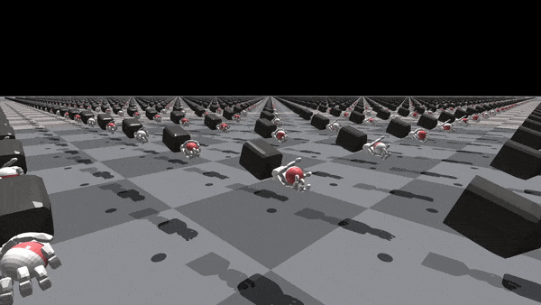
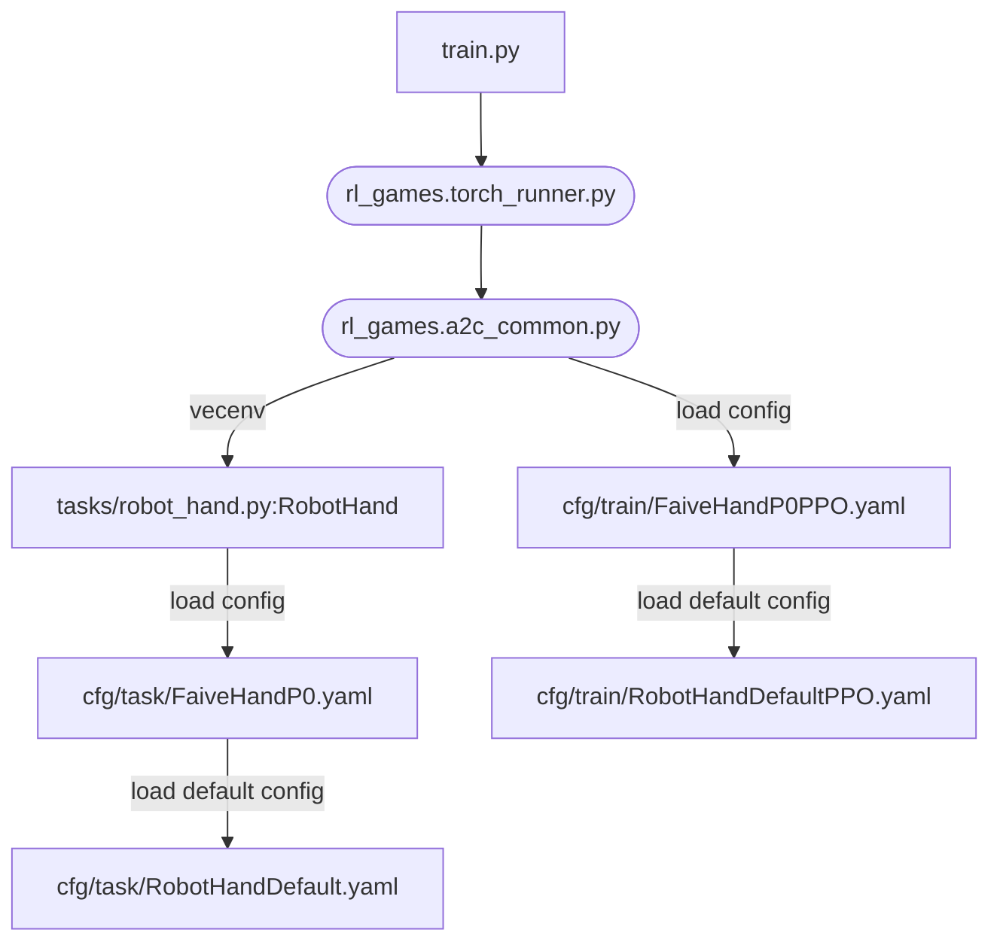
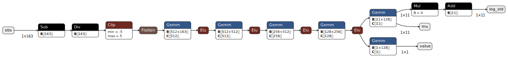

# faive_gym
IsaacGym environments for the Faive Hand (and also somewhat easily extendable to other robotic hands), intended to be used together with [IsaacGymEnvs](https://github.com/NVIDIA-Omniverse/IsaacGymEnvs)


## Resources

* [faive_gym tutorial video](https://www.youtube.com/watch?v=Nwa7xP3RtO0): A video tutorial on how to get started with the faive_gym library to train a policy with RL, configure the environment, and load your own robot model in the framework.
* [faive_gym tips document](https://docs.google.com/document/d/1n91q4nECS4vzkC2Jn62DxLiTA15WmdjJsbqNxEuv4tE/edit?usp=sharing): shared Google doc with tips on how to use the library effectively.
* [RL knowledge dump document](https://docs.google.com/document/d/1mLH4pmkmL0SE-hknsB_qGlR9QBu4GYbEzk0ho16TDC4/edit?usp=sharing): another shared Google doc with general tips about RL for manipulation

---

* [Paper (arxiv)](https://arxiv.org/abs/2308.02453): The preprint for our Humanoids 2023 paper which uses `faive_gym`. If you use this library in your work, please cite this paper.
* [Project website](https://srl-ethz.github.io/get-ball-rolling/): website introducing our Humanoids 2023 paper.
* [Project overview video](https://www.youtube.com/watch?v=YahsMhqNU8o): 3-minute video introducing our Humanoids 2023 work with the Faive Hand.

## Installation Steps

1. Install Isaac Gym
    1. Download Isaac Gym Preview 4 from the [website](https://developer.nvidia.com/isaac-gym)
	1. Check isaacgym/docs/index.html for install instructions, but this README also documents a fast way to set it up
    1. Recommended: create a conda or venv (virtual environment) Python 3.8 environment for installation. To create and activate a Python 3.8 venv,
	    1. `python3.8 -m venv ~/rlgpu` to create a new venv called "rlgpu" in the home directory. You might have to first run `sudo apt install python3.8-venv` to install the virtual environment package.
		1. `source ~/rlgpu/bin/activate` to activate the venv. You must run this to enter the venv every time a new terminal is opened.
    1. Install isaacgym with pip
	    ```bash
	    cd /path/to/isaacgym/python
	    pip install -e .
	    ```
		You might have to first run `sudo apt install python3.8-dev`.
	1. test installation
	    ```bash
		cd examples
		python joint_monkey.py
		# if you are connecting to a remote instance from Windows, GUI is not available so this command will fail- in which case you could run a non-GUI example program, e.g.
		python asset_info.py
		```
1. Install IsaacGymEnvs
    1. Clone the repository
		```bash
		git clone https://github.com/NVIDIA-Omniverse/IsaacGymEnvs
		```
		You might have to first run `sudo apt install git`.
	1. Install with pip
		```bash
		cd /path/to/IsaacGymEnvs
		pip install -e .
		```
	1. Test installation
		```bash
		cd isaacgymenvs
		python train.py
		```
	1. [optional] If an error about protobuf version appears, you may have to specify the version of protobuf, with
		```bash
		pip install --upgrade protobuf==3.20.0
		```
	1. [optional] if the error `ModuleNotFoundError: No module named 'tkinter'` appears, you must install it with
		```bash
		sudo apt install python3-tk
		```
1. Install this repository (faive_gym)
    1. Clone this repository (if you will clone the internal closed source repo, you will have to [add the SSH public key to your GitHub account](https://docs.github.com/en/authentication/connecting-to-github-with-ssh/adding-a-new-ssh-key-to-your-github-account))
		```bash
		git clone https://github.com/srl-ethz/faive_gym_oss
		# if you want to use the internal closed source repo, instead run
		git clone git@github.com:srl-ethz/faive_gym.git
		```
	1. Install with pip
		```bash
		cd /path/to/faive_gym
		pip install -e .
		```

The default Faive Hand training environment can be run with
```bash
cd /path/to/faive_gym/faive_gym
python train.py task=FaiveHandP0
```

## Additional Arguments
Some additional arguments that can be appended; This has the same effect as modifying the yaml files in faive_gym/cfg directory, and could be used to easily change hyperparameters across runs. (check IsaacGymEnvs documentation for more)

arguments | meaning
--- | --- 
capture_video=True force_render=False | occasionaly capture video while training and save it to videos/ (also uploads to W&B, if that is enabled). This also disables the windows from popping up.
capture_video_freq=2000 capture_video_len=200 | adjust the frequency / length of recording (save a video of length 200 steps every 2000 steps). If this is not set when the above arguments are set, the default settings for video capture will be used.
num_envs=8 | try with fewer robot instances (useful for debugging)
headless=True | run without GUI
test=True | no training, just rollout policy
checkpoint=runs/FaiveHand/nn/*.pth | load from checkpoint (combine with `test=True` to test out trained policy without training)
wandb_activate=True wandb_group=srl_ethz wandb_project=your_project_name wandb_name=your_run_name | log this run in Weights & Biases
task.env.env_spacing=0.7 | Any value defined in the config yaml files can be modified. This is an example of how to modify the values defined in faive_gym/cfg/task/RobotHandDefault.yaml

## using the Python `wandb` package for Weights and Biases
when using the Weights & Biases feature, there might be an error which requires you to install xvfb and ffmpeg, with `sudo apt install xvfb` and `sudo apt install ffmpeg`.

## Loading your own robotic hand model
1. Prepare a MJCF (URDF) model of your robot. **Even models that can be perfectly simulated in MuJoCo might not work in IsaacGym as IsaacGym's model conversion script does not support all modeling features**, so it might require some trial and error to adjust the model file before you can actually load it into IsaacGym.
1. within *faive_gym/cfg/task* and *faive_gym/cfg/train* directory, respectively from *FaiveHandP0.yaml* and *FaiveHandP0PPO.yaml* to create *your_robot_name.yaml* and *your_robot_namePPO.yaml* files, 
1. Modify the cfg files for your own robot in *your_robot_name.yaml*:
    - change `asset.model_file` to the path of your model file, relative to the assets/ directory.
    - `env.numActions` and the `observation.obs_dims` must be set with the degrees of freedom (DoF) for your robot
	- `observations.obs_dims.dof_pos_history` must be set to a multiple of the DoFs of your robot.
	- `asset.force_sensor_names` and `asset.pose_sensor_names` should be set to the name of the bodies at the fingertip. They are the fingertip force and pose sensors. (technically, the sensors can be placed on any body, but placing them on the fingertip would make the most sense for dexterous tasks)
	- if the number of fingers on your hand is not 5, change `observations.obs_dims.pose_sensor_*` and `observations.obs_dims.force_sensor_force` to \[number of fingers\] \* \[sensor dimension\]
1. try running train.py with your new environment, with `python train.py num_envs=2 task=your_robot_name`
    Take a good look at the error statements in the terminal and the model that appears in the window to make sure it's loaded correctly.
1. If you want to set it up for the cube rotation task, adjust the robot pose with `env.hand_start_p` and `env.hand_start_r` so that the cube falls onto the robot's palm. You can also try to adjust some other parameters defined in RobotHandDefault.yaml to suit your usage (try not to edit RobotHandDefault, just override the parameters values in your own yaml file)

## Program Structure
Grossly oversimplified diagram of how the data flows in this program after train.py (round nodes indocate programs in rl_games)



## Export a trained RL policy
This will output a .onnx and .pt file to the same directory, which can be loaded in faive_franka_control or other solutions to run the policy on the real robot.
The output files, created in the folder `faive_gym/exported_policies`, will have the names `[policy_name]_[timestamp]`, where `policy_name` is set by the `wandb_name`
parameter. The export can be ran as follows:
```bash
python export_policy.py task=FaiveHandP0 checkpoint=/path/to/checkpoint/FaiveHand.pth wandb_name=policy_name
```
To check if the `.onnx` outputs are correct, you can use [netron](https://netron.app/). An exported `.onnx` should produce the following archtiecture:


To export several models at the same time (which can be handy when testing several policies on the robot), refer to `scripts/export_all_policies.py`.


## Recording observations and joint positions for debugging
You can record all observations and joint positions for an already trained policy by running:
```
python train.py task=FaiveHandP0 headless=True test=True checkpoint=runs/FaiveHand/nn/[your_checkpoint.pth] num_envs=[env_number] task.logging.record_dofs=True task.logging.record_observations=True task.logging.record_length=[your_record_length]
```
As all environments are recorded in parallel, it is advised not to use a high number of environments - lower hundreds will work, but a high number of envs + long recordings could lead to memory issues.
The recording length is given in the number of environment steps that are recording, if you'd like to record for a certain amount of seconds, check the task.sim.dt constant.

## Other comments
If you use this library in your work, please cite:
```
@misc{toshimitsu2023getting,
	title={Getting the Ball Rolling: Learning a Dexterous Policy for a Biomimetic Tendon-Driven Hand with Rolling Contact Joints}, 
	author={Yasunori Toshimitsu and Benedek Forrai and Barnabas Gavin Cangan and Ulrich Steger and Manuel Knecht and Stefan Weirich and Robert K. Katzschmann},
	year={2023},
	eprint={2308.02453},
	archivePrefix={arXiv},
	primaryClass={cs.RO}
}
```